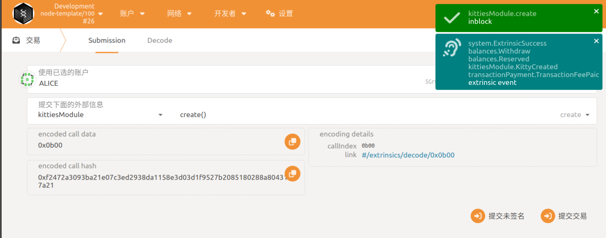

## 1. 完成课程中的pallet功能，在本地可以编译通过，运行。

## 2. KittyIndex不在pallet中指定，而是在runtime里面绑定

## 3. 扩展存储，能得到一个账号拥有的所有kitties

## 4. create和breed需要质押一定数量的token，在transfer的时候能转移质押。

## 5. 通过polkadot js可以成功调用pallet里面的功能
### （1）创建猫咪
- **Alice创建了4只猫咪**

- **Bob创建了2只猫咪**

### （2）查看帐号下拥有的所有猫咪

### （3）查看猫咪主人

### （4）繁殖猫咪

### （5）转移猫咪
- **无转移权限**

- **转移给EVE**

